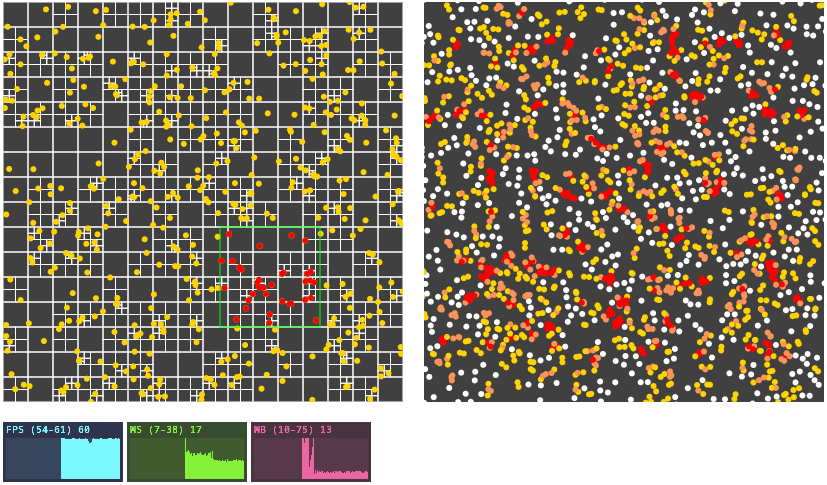

# Quadtree

Live Demo can be opened [here](https://tsopeh.github.io/quadtree). This exploration of Quadtrees was inspired by
CodingTrain's [repository](https://github.com/CodingTrain/QuadTree) and videos.

## Development

1. `yarn install` — To install the dependencies
2. `yarn run dev` — To serve the project
3. `http://localhost:5173/` — Open the link in the browser
